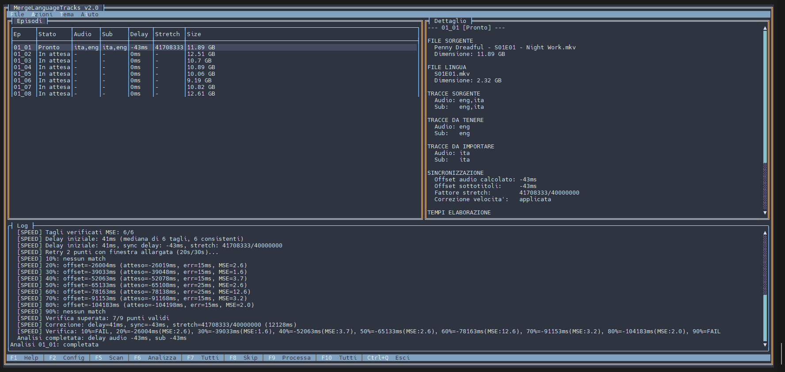
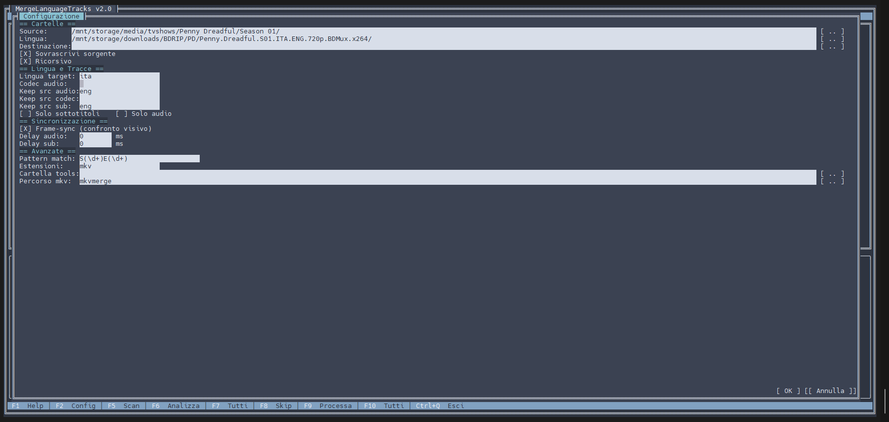
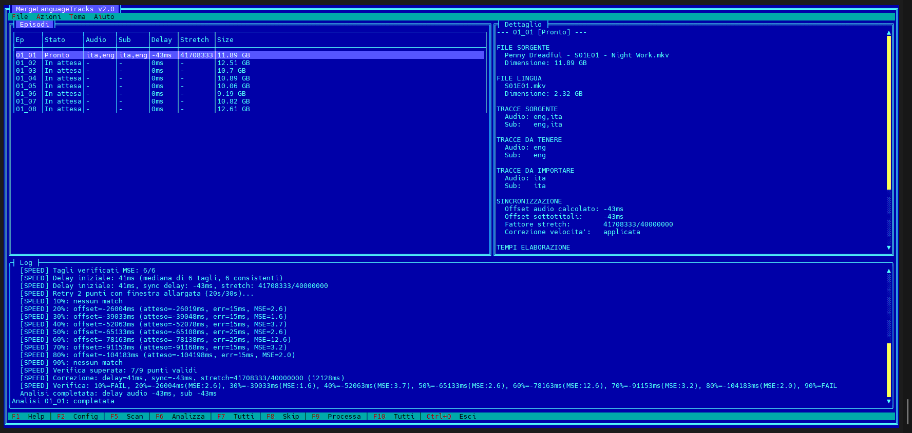
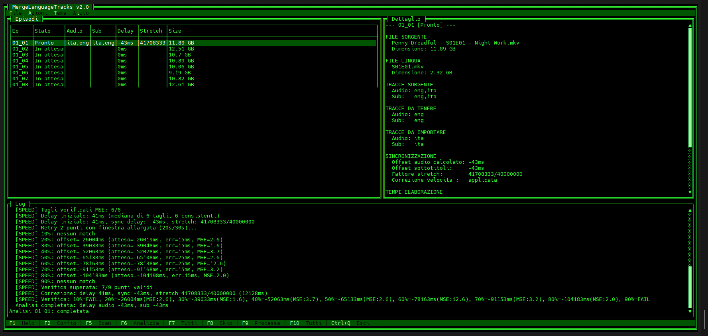
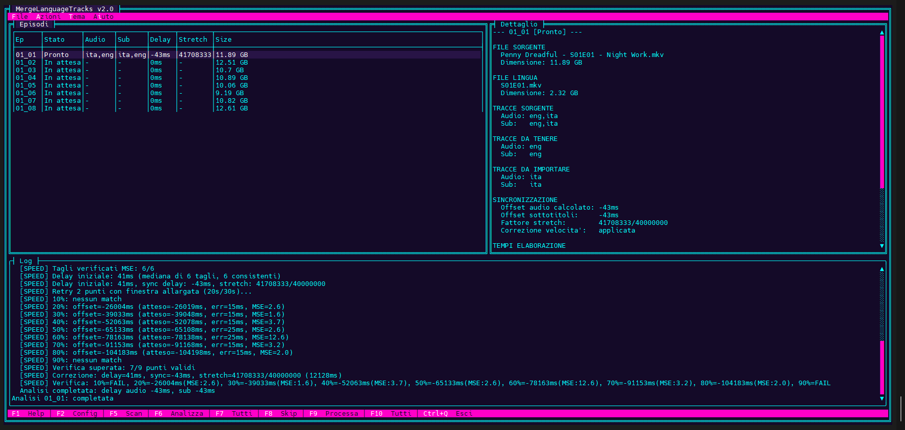
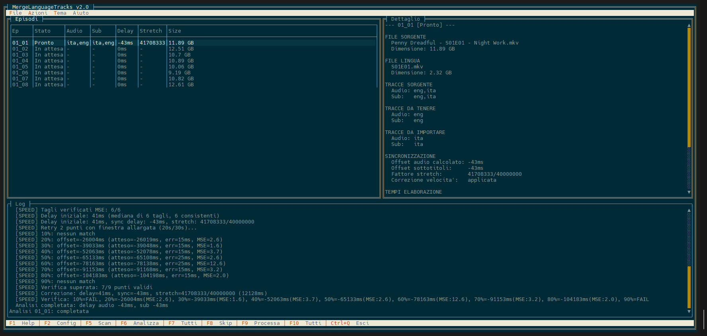
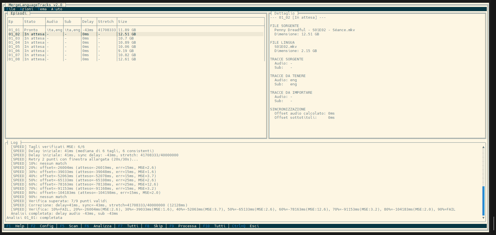
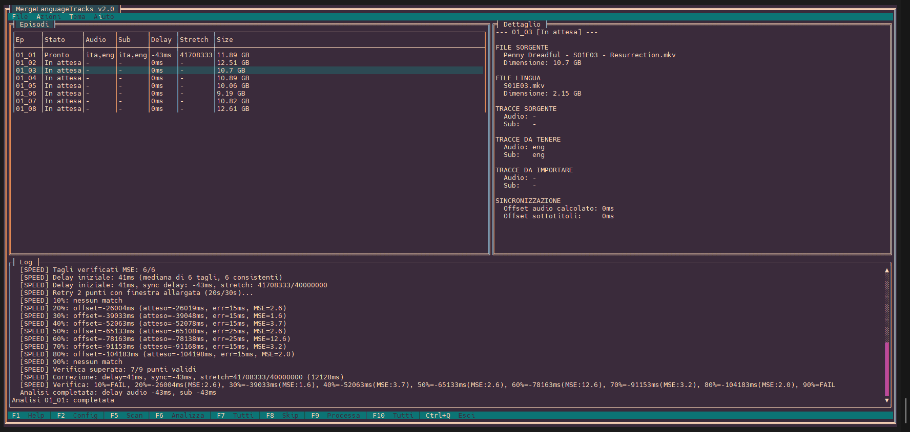
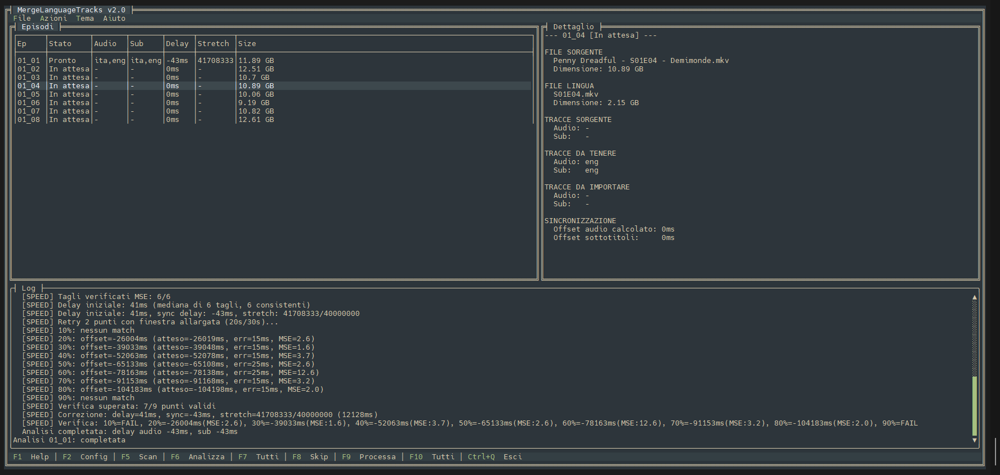

# MergeLanguageTracks

Applicazione cross-platform per unire tracce audio e sottotitoli da file MKV in lingue diverse. Disponibile in modalita' CLI e con interfaccia grafica TUI.

## A cosa serve?

Consente di combinare tracce audio e sottotitoli da file MKV di release diverse, utile quando si dispone di una versione con video di qualita' superiore ma si desidera integrare l'audio o i sottotitoli da un'altra versione.

L'applicazione elabora automaticamente intere stagioni, abbinando gli episodi corrispondenti e applicando la sincronizzazione automatica per compensare eventuali differenze di montaggio o velocita' tra le release.

## Modalita' di utilizzo

### TUI (Interfaccia Grafica)

Lanciando l'applicazione senza parametri si apre l'interfaccia grafica basata su Terminal.Gui.

L'interfaccia e' organizzata in tre pannelli: tabella episodi, dettaglio episodio selezionato, log in tempo reale. In alto la barra menu, in basso la barra di stato con i tasti rapidi.



**Menu:**

- **File**: Configurazione (F2), Esci (Ctrl+Q)
- **Azioni**: Scan file (F5), Analizza selezionato (F6), Analizza tutti (F7), Skip/Unskip (F8), Processa selezionato (F9), Processa tutti (F10)
- **Tema**: cambio tema grafico
- **Aiuto**: Info e help (F1)

**Tasti rapidi:**

| Tasto | Azione |
|-------|--------|
| F1 | Help |
| F2 | Apre configurazione |
| F5 | Scan cartelle e matching episodi |
| F6 | Analizza episodio selezionato |
| F7 | Analizza tutti gli episodi pendenti |
| F8 | Skip/Unskip episodio selezionato |
| F9 | Merge episodio selezionato |
| F10 | Merge tutti gli episodi analizzati |
| Enter | Modifica delay manuale episodio |
| Ctrl+Q | Esci |

**Configurazione (F2):**

Il dialog di configurazione raggruppa tutte le opzioni:



- **Cartelle**: Source, Lingua, Destinazione, con pulsante browse per ciascuna. Checkbox per sovrascrivere sorgente e ricerca ricorsiva.
- **Lingua e Tracce**: Lingua target, Codec audio, Keep source audio/codec/sub, Solo sottotitoli, Solo audio.
- **Sincronizzazione**: Frame-sync (checkbox), Delay audio (ms), Delay sub (ms).
- **Avanzate**: Pattern match (regex), Estensioni file, Cartella tools, Percorso mkvmerge.

**Temi:**

Disponibili 8 temi selezionabili dal menu Tema:

| Nord (default) | DOS Blue |
|:-:|:-:|
|  |  |

| Matrix | Cyberpunk |
|:-:|:-:|
|  |  |

| Solarized Dark | Solarized Light |
|:-:|:-:|
|  |  |

| Cybergum | Everforest |
|:-:|:-:|
|  |  |

### CLI (Linea di comando)

Per elaborazione scriptabile e automatizzata.

```bash
MergeLanguageTracks -s "D:\Serie.ENG" -l "D:\Serie.ITA" -t ita -d "D:\Output" -fs
```

## Sincronizzazione

L'applicazione offre due sistemi di sincronizzazione automatica, entrambi basati sull'analisi visiva dei frame video tramite ffmpeg.

### Correzione Velocita' (Automatica)

Capita spesso con serie TV e film europei: la release italiana e' a 25fps (standard PAL) mentre quella americana e' a 23.976fps (NTSC). L'audio e' leggermente piu' veloce in una delle due versioni e un semplice merge produrrebbe un desync che peggiora nel tempo.

L'applicazione rileva automaticamente questa situazione confrontando gli FPS dei due file e corregge senza bisogno di opzioni. La correzione avviene interamente in mkvmerge tramite time-stretching, senza ricodifica audio.

**Come funziona:**

1. Confronta la velocita' dei due file leggendo le informazioni delle tracce video tramite mkvmerge. Se la differenza e' trascurabile (meno dello 0.1%) non fa nulla
2. Estrae i frame video iniziali da entrambi i file tramite ffmpeg e li converte in immagini in scala di grigi a bassa risoluzione per un confronto rapido
3. Individua i "tagli scena" in entrambi i file, cioe' i punti dove l'immagine cambia bruscamente (stacco di montaggio, cambio inquadratura). Questi tagli sono identici in entrambe le versioni indipendentemente dalla lingua
4. Abbina i tagli tra sorgente e lingua per calcolare il ritardo iniziale. Poiche' i due file hanno velocita' diverse, il ritardo non e' costante: cresce nel tempo. L'algoritmo compensa questo "drift" nel calcolo
5. Verifica il risultato in 9 punti distribuiti lungo tutto il video (al 10%, 20%, ... 90% della durata). In ogni punto estrae un segmento breve, trova i tagli scena e conferma che il delay calcolato sia corretto. Se un punto fallisce, riprova con un segmento piu' lungo. Servono almeno 5 punti validi su 9
6. Calcola il fattore di correzione e lo applica tramite mkvmerge alle tracce audio e sottotitoli importate, senza toccare il video e senza ricodifica

### Frame-Sync (Opzionale)

Quando sorgente e lingua hanno lo stesso FPS ma le tracce audio o sottotitoli non sono allineate temporalmente (intro piu' lunga, secondi di nero, crediti diversi all'inizio), serve un offset fisso per riallinearle. Frame-sync calcola automaticamente questo delay.

Attivabile con **-fs** da CLI o dal checkbox nella configurazione TUI.

**Come funziona:**

1. Estrae i frame video iniziali da entrambi i file (2 minuti dal sorgente, 3 dalla lingua) e li converte in immagini in scala di grigi a bassa risoluzione
2. Individua i tagli scena (cambi di inquadratura) in entrambi i file
3. Per ogni possibile coppia di tagli tra sorgente e lingua, calcola quale sarebbe il delay se quei due tagli corrispondessero allo stesso momento del video
4. Usa un sistema di "votazione": il delay che riceve piu' voti coerenti viene selezionato come candidato. Se molti tagli suggeriscono lo stesso offset, la probabilita' che sia corretto e' alta
5. Verifica il candidato confrontando la "firma visiva" attorno ai tagli: se i frame prima e dopo il taglio sono simili tra sorgente e lingua (stessa scena), il match e' confermato
6. Conferma il risultato in 9 punti distribuiti lungo il video (10%, 20%, ... 90%). Per ogni punto estrae un segmento breve, trova i tagli scena locali e verifica che il delay sia coerente. Se un punto fallisce, riprova con un segmento piu' ampio. Servono almeno 5 punti validi su 9

**Quando serve Frame-Sync e quando no:**

- **Non serve** se le due versioni sono identiche a meno della lingua audio (stesso encode, stesso taglio). Il merge diretto funziona
- **Non serve** se la differenza e' solo di velocita' (23.976 vs 25 fps). La correzione automatica gestisce questo caso
- **Serve** quando c'e' un offset fisso tra le due versioni: intro piu' lunga, secondi di nero, taglio diverso all'inizio
- **Non funziona** se le differenze sono a meta' episodio (scene tagliate o aggiunte nel mezzo). In quel caso nessun delay costante puo' correggere il disallineamento

**Delay manuale:**

I parametri **-ad** e **-sd** specificano un offset in millisecondi che viene **sommato** al risultato di frame-sync o speed correction. Nella TUI e' possibile impostare delay diversi per singolo episodio tramite Enter.

## Casi d'uso

**1. Aggiungere doppiaggio italiano a release inglese**

```bash
MergeLanguageTracks -s "D:\Serie.ENG" -l "D:\Serie.ITA" -t ita -d "D:\Output" -fs
```

**2. Sovrascrivere i file sorgente**

```bash
MergeLanguageTracks -s "D:\Serie.ENG" -l "D:\Serie.ITA" -t ita -o -fs
```

**3. Sostituire una traccia lossy con una lossless**

Il file ha gia' l'italiano AC3 lossy. Vuoi sostituirlo con DTS-HD MA da un'altra release.

```bash
MergeLanguageTracks -s "D:\Serie" -l "D:\Serie.ITA.HDMA" -t ita -ac "DTS-HD MA" -ksa eng,jpn -d "D:\Output" -fs
```

Con **-ksa eng,jpn** mantieni solo inglese e giapponese dal sorgente. Con **-ac "DTS-HD MA"** prendi solo la traccia lossless dalla release italiana.

**4. Remux multilingua da release diverse**

Ogni passaggio prende come sorgente l'output del precedente.

```bash
MergeLanguageTracks -s "D:\Film.US" -l "D:\Film.ITA" -t ita -d "D:\Temp1" -fs
MergeLanguageTracks -s "D:\Temp1" -l "D:\Film.FRA" -t fra -d "D:\Temp2" -fs
MergeLanguageTracks -s "D:\Temp2" -l "D:\Film.GER" -t ger -d "D:\Output" -fs
```

**5. Anime con naming non standard**

Molti fansub usano "- 05" invece di S01E05. Con **-m** specifichi una regex custom. Con **-so** prendi solo i sottotitoli.

```bash
MergeLanguageTracks -s "D:\Anime.BD" -l "D:\Anime.Fansub" -t ita -m "- (\d+)" -so -d "D:\Output" -fs
```

**6. Daily show con date nel nome file**

```bash
MergeLanguageTracks -s "D:\Show.US" -l "D:\Show.ITA" -t ita -m "(\d{4})\.(\d{2})\.(\d{2})" -d "D:\Output"
```

**7. Filtrare sottotitoli dal sorgente**

Il sorgente ha 10 tracce sub in lingue inutili. Con **-kss** tieni solo quelle che vuoi.

```bash
MergeLanguageTracks -s "D:\Serie.ENG" -l "D:\Serie.ITA" -t ita -so -kss eng -d "D:\Output" -fs
```

**8. Anime: tenere solo audio giapponese e importare eng+ita**

Il trucco **-kss und** scarta tutti i sottotitoli dal sorgente perche' nessuna traccia ha lingua "und".

```bash
MergeLanguageTracks -s "D:\Anime.BD.JPN" -l "D:\Anime.ITA" -t eng,ita -ksa jpn -kss und -d "D:\Output" -fs
```

**9. Dry run su configurazione complessa**

Con **-n** verifica matching e tracce senza eseguire.

```bash
MergeLanguageTracks -s "D:\Serie.ENG" -l "D:\Serie.ITA" -t ita -ac "E-AC-3" -ksa eng -kss eng -d "D:\Output" -fs -n
```

**10. Tenere solo tracce DTS dal sorgente**

```bash
MergeLanguageTracks -s "D:\Serie.ENG" -l "D:\Serie.ITA" -t ita -ksac DTS -d "D:\Output" -fs
```

**11. Tenere solo audio inglese lossless dal sorgente**

Combinando **-ksa** e **-ksac**, mantieni solo tracce che soddisfano entrambi i criteri.

```bash
MergeLanguageTracks -s "D:\Serie.ENG" -l "D:\Serie.ITA" -t ita -ksa eng -ksac "DTS-HDMA,TrueHD" -d "D:\Output" -fs
```

**12. Importare piu' codec dal file lingua**

```bash
MergeLanguageTracks -s "D:\Serie.ENG" -l "D:\Serie.ITA" -t ita -ac "E-AC-3,DTS" -d "D:\Output" -fs
```

**13. Singola sorgente: applicare delay e filtrare tracce**

Senza **-l**, l'applicazione usa la cartella sorgente anche come lingua. Permette di remuxare con filtri e delay senza una release separata.

```bash
MergeLanguageTracks -s "D:\Serie" -t ita -ksa jpn,eng -kss eng,jpn -ad 960 -sd 960 -o
```

## Report

A fine elaborazione viene mostrato un report riassuntivo. In modalita' TUI il dettaglio e' visibile nel pannello laterale di ciascun episodio.

Da CLI il report mostra 3 tabelle:

```
========================================
  Report Dettagliato
========================================

SOURCE FILES:
  Episode     Audio               Subtitles           Size
  ----------------------------------------------------------------
  01_05       eng,jpn             eng                 4.2 GB

LANGUAGE FILES:
  Episode     Audio               Subtitles           Size
  ----------------------------------------------------------------
  01_05       ita                 ita                 2.1 GB

RESULT FILES:
  Episode     Audio          Subtitles      Size      Delay       FrmSync   Speed     Merge
  ------------------------------------------------------------------------------------------
  01_05       eng,jpn,ita    eng,ita        4.3 GB    +150ms      -         1250ms    12500ms
```

**Colonne Result Files:**
- **Delay**: offset applicato alle tracce importate
- **FrmSync**: tempo di elaborazione frame-sync (se attivo, altrimenti "-")
- **Speed**: tempo di elaborazione speed correction (se attiva, altrimenti "-")
- **Merge**: tempo di esecuzione mkvmerge

In modalita' dry run, Size e Merge mostrano "N/A" perche' il merge non viene eseguito.

## Codec Audio

Quando specifichi **-ac** o **-ksac** per filtrare i codec, il matching e' **ESATTO**, non parziale. Entrambi supportano valori multipli separati da virgola.

**Perche' e' importante:**

Se un file ha sia DTS (core) che DTS-HD MA, e tu scrivi **-ac "DTS"**, prende SOLO il DTS core, non il DTS-HD. Se vuoi il DTS-HD Master Audio, devi scrivere **-ac "DTS-HDMA"**. Se vuoi entrambi, scrivi **-ac "DTS,DTS-HDMA"**.

I nomi codec sono case-insensitive. Se un codec non viene riconosciuto con lookup diretto, viene provato un match senza trattini, spazi e due punti.

**Dolby:**

| Codec | Alias accettati | Descrizione |
|-------|----------------|-------------|
| AC-3 | AC3, DD | Dolby Digital, il classico 5.1 lossy |
| E-AC-3 | EAC3, DD+, DDP | Dolby Digital Plus, usato per Atmos lossy su streaming |
| TrueHD | TRUEHD | Dolby TrueHD, lossless, usato per Atmos su Blu-ray |
| MLP | | Meridian Lossless Packing (base di TrueHD) |
| ATMOS | | Alias speciale: matcha sia TrueHD che E-AC-3 |

**DTS:**

| Codec | Alias accettati | Descrizione |
|-------|----------------|-------------|
| DTS | | Solo DTS Core/Digital Surround (NON matcha DTS-HD) |
| DTS-HD | | Matcha sia DTS-HD Master Audio che DTS-HD High Resolution |
| DTS-HD MA | DTS-HDMA | DTS-HD Master Audio, lossless |
| DTS-HD HR | DTS-HDHR | DTS-HD High Resolution |
| DTS-ES | | DTS Extended Surround (6.1) |
| DTS:X | DTSX | Object-based, estensione di DTS-HD MA |

**Lossless:**

| Codec | Alias accettati | Descrizione |
|-------|----------------|-------------|
| FLAC | | Free Lossless Audio Codec |
| PCM | LPCM, WAV | Audio raw non compresso |
| ALAC | | Apple Lossless |

**Lossy:**

| Codec | Alias accettati | Descrizione |
|-------|----------------|-------------|
| AAC | HE-AAC | Advanced Audio Coding |
| MP3 | | MPEG Audio Layer 3 |
| MP2 | | MPEG Audio Layer 2 |
| Opus | OPUS | Opus (WebM) |
| Vorbis | VORBIS | Ogg Vorbis |

## Codici Lingua

I codici lingua sono ISO 639-2 (3 lettere). I piu' comuni:

- **ita** - Italiano
- **eng** - Inglese
- **jpn** - Giapponese
- **ger** o **deu** - Tedesco
- **fra** o **fre** - Francese
- **spa** - Spagnolo
- **por** - Portoghese
- **rus** - Russo
- **chi** o **zho** - Cinese
- **kor** - Coreano
- **und** - Undefined (lingua non specificata)

Se sbagli un codice, l'applicazione suggerisce quello corretto tramite il LanguageValidator:

```
Lingua 'italian' non riconosciuta.
Forse intendevi: ita?
```

## Requisiti

- [MKVToolNix](https://mkvtoolnix.download/) installato (mkvmerge deve essere nel PATH o specificato con **-mkv**)
- ffmpeg per frame-sync e speed correction (scaricato automaticamente nella cartella tools se mancante)
- Locale UTF-8 su Linux (necessario per nomi file con caratteri non-ASCII)

**Piattaforme supportate** (da csproj RuntimeIdentifiers):

- Windows (x64)
- Linux (x64, ARM64)
- macOS (x64, ARM64)

## Build

Richiede .NET 10 SDK. Il progetto usa Terminal.Gui 2.0.0-develop.5118.

```bash
# Build per la piattaforma corrente
dotnet build -c Release

# Publish come eseguibile standalone (single file, compresso)
dotnet publish -c Release -r win-x64 --self-contained true
dotnet publish -c Release -r linux-x64 --self-contained true
dotnet publish -c Release -r linux-arm64 --self-contained true
dotnet publish -c Release -r osx-x64 --self-contained true
dotnet publish -c Release -r osx-arm64 --self-contained true
```

## Riferimento Parametri

### Obbligatori

| Short | Long | Descrizione |
|-------|------|-------------|
| -s | --source | Cartella con i file MKV sorgente |
| -t | --target-language | Codice lingua delle tracce da importare (es: ita). Separare con virgola per piu' lingue: ita,eng |

### Sorgente

| Short | Long | Descrizione |
|-------|------|-------------|
| -l | --language | Cartella con i file MKV da cui prendere le tracce. Se omesso, usa la cartella sorgente |

### Output (mutuamente esclusivi, uno obbligatorio)

| Short | Long | Descrizione |
|-------|------|-------------|
| -d | --destination | Cartella dove salvare i file risultanti |
| -o | --overwrite | Sovrascrive i file sorgente (flag, nessun valore) |

### Sync

| Short | Long | Descrizione |
|-------|------|-------------|
| -fs | --framesync | Sincronizzazione tramite confronto visivo frame (scene-cut) |
| -ad | --audio-delay | Delay manuale in ms per l'audio (sommato a frame-sync/speed se attivi) |
| -sd | --subtitle-delay | Delay manuale in ms per i sottotitoli |

La correzione velocita' (stretch) e' sempre automatica e non richiede parametri.

### Filtri

| Short | Long | Descrizione |
|-------|------|-------------|
| -ac | --audio-codec | Codec audio da importare dal file lingua. Separa con virgola: DTS,E-AC-3 |
| -so | --sub-only | Importa solo sottotitoli, ignora l'audio |
| -ao | --audio-only | Importa solo audio, ignora i sottotitoli |
| -ksa | --keep-source-audio | Lingue audio da MANTENERE nel sorgente (le altre vengono rimosse) |
| -ksac | --keep-source-audio-codec | Codec audio da MANTENERE nel sorgente. Separa con virgola: DTS,TrueHD |
| -kss | --keep-source-subs | Lingue sub da MANTENERE nel sorgente |

### Matching

| Short | Long | Descrizione | Default |
|-------|------|-------------|---------|
| -m | --match-pattern | Regex per matching episodi | S(\d+)E(\d+) |
| -r | --recursive | Cerca nelle sottocartelle | attivo |
| -ext | --extensions | Estensioni file da cercare. Separa con virgola: mkv,mp4,avi | mkv |

### Pattern Regex Comuni

L'applicazione usa i gruppi catturati dalla regex per abbinare i file. Ogni gruppo tra parentesi viene concatenato con "_" per creare l'ID univoco dell'episodio.

| Formato | Esempio File | Pattern |
|---------|--------------|---------|
| Standard | Serie.S01E05.mkv | S(\d+)E(\d+) |
| Con punto | Serie.S01.E05.mkv | S(\d+)\.E(\d+) |
| Formato 1x05 | Serie.1x05.mkv | (\d+)x(\d+) |
| Solo episodio | Anime - 05.mkv | - (\d+) |
| Episodio 3 cifre | Anime - 005.mkv | - (\d{3}) |
| Daily show | Show.2024.01.15.mkv | (\d{4})\.(\d{2})\.(\d{2}) |

**Come funziona:** Il pattern **S(\d+)E(\d+)** cattura due gruppi (stagione e episodio). Per "S01E05" crea l'ID "01_05". File sorgente e lingua con lo stesso ID vengono abbinati.

### Altro

| Short | Long | Descrizione | Default |
|-------|------|-------------|---------|
| -n | --dry-run | Mostra cosa farebbe senza eseguire | |
| -h | --help | Mostra l'help integrato | |
| -mkv | --mkvmerge-path | Percorso custom di mkvmerge | mkvmerge (cerca nel PATH) |
| -tools | --tools-folder | Cartella per ffmpeg scaricato | |

